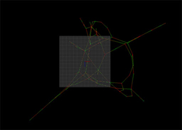
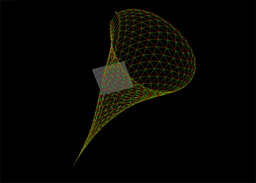
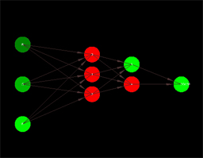

SCEJS
============

Multipurpose Javascript 3D graphic library 
<h2><a href="https://rawgit.com/stormcolor/SCEJS/master/APIdoc/APIdoc/SCE.html">API Doc</a></h2>
 

<h2>DEMOS</h2>
 
		<a href="http://stormcolour.appspot.com/js/libs/SCEJS/demos/basic/index.html">- Basic</a> 
 
		<a href="http://stormcolour.appspot.com/js/libs/SCEJS/demos/graph/index.html">- Graph</a> 
		  
 
		<a href="http://stormcolour.appspot.com/js/libs/SCEJS/demos/graph-rb-files/index.html">- Graph from RB files</a> 
		  
 
		<a href="http://stormcolour.appspot.com/js/libs/SCEJS/demos/graph-custom-layout/index.html">- Graph Custom</a> 
		  
 
        <a href="http://stormcolour.appspot.com/js/libs/SCEJS/demos/graph-neuronal-network/index.html">- Graph Neuronal network</a> 
          
 
		<a href="http://stormcolour.appspot.com/js/libs/SCEJS/demos/voxels-path-tracing/index.html">- Voxels Path-Tracing</a> 
		  

 
 
